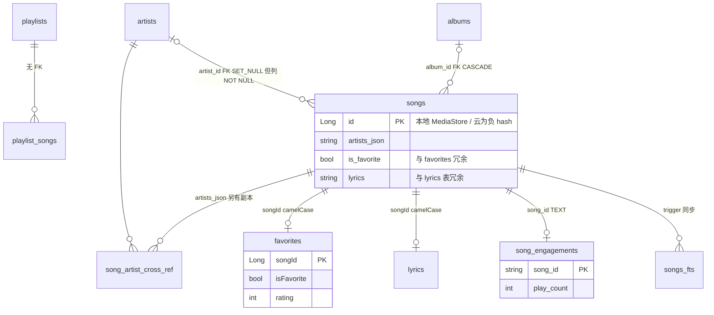
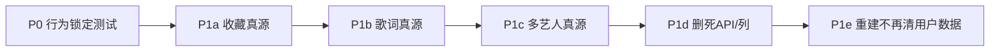

# 数据库设计审查与修复方案

> 状态：**实现中**（见 §2.9 实现进度）  
> 范围：`data/database/*`、`di/AppModule` 装配、`SyncWorker` / 云仓库写入路径、schema 导出 v1–v12、migration 测试、备份导入  
> 关联：`AGENTS.md`「关键架构速查」、`docs/stats-design.md`、`docs/listening-stats-redesign.md`

---

## 0. 总体结构

- 单一 Room 库 `pixelplayer_database`，**version = 12**，`exportSchema = true`（schema 在 `app/schemas/.../1.json` … `12.json`）。
- 22 张实体表；本地 MediaStore 曲、Navidrome / Jellyfin 云曲统一进 `songs`，用 `source_type` + **负 Long id** 分区。
- JournalMode = WAL。
- 运行时 artifact（收藏同步 trigger、FTS 同步 trigger）由 `PixelPlayerDatabase.createRuntimeArtifactsCallback()` 安装。



---

## 1. 审查结论

### 1.1 严重问题（会丢数据 / 会静默错）

#### P0-1 `insertSongs` 的 upsert 会覆盖用户态字段

`MusicDao.insertSongs`：冲突则 `@Update` **整行**（`MusicDao.kt` 约 159–169 行）。

本地同步在 `SyncWorker.kt` 约 1015–1038 行用 `copy()` 保住了 `lyrics` 和 `*_user_edited`，但 **没保住 `isFavorite`**。云同步更糟——Navidrome / Jellyfin 统一表实体写死：

```kotlin
isFavorite = false,
lyrics = null,
```

一旦同一 `songId` 走 `insertSongs` 的 UPDATE 分支，**收藏和 `songs.lyrics` 会被抹掉**。

收藏的「真源」写在 `favorites` 表（`MusicRepositoryImpl.setFavoriteStatus`），靠 trigger 回写 `songs.is_favorite`。UPDATE 覆盖后不会被自动修回来。列表 UI 走 `favorites` JOIN 看起来还在；`Song.isFavorite`（播放器、NLP mood、MediaStore 映射）读的是 `songs.is_favorite`，会不一致。

#### P0-2 Trigger 只在 `onCreate` 安装，升级 / 备份恢复后会丢

`createRuntimeArtifactsCallback()` 只覆盖 `onCreate`。老库 upgrade 走 migration **不会**重装 trigger；Auto Backup 可能恢复出「版本号正确但 trigger 缺失」的库（`Migrations.kt` 开头自己也承认会 column drift）；`fallbackToDestructiveMigration` 只在 DEBUG，release 直接炸或静默缺 trigger。

后果：收藏双写不同步、FTS 不更新（搜索只剩 LIKE 兜底）。

#### P0-3 多源冗余没有唯一真源

| 数据 | 存放处 | 读取方 | 同步机制 |
|---|---|---|---|
| 收藏 | `favorites` + `songs.is_favorite` + DataStore `FAVORITE_SONG_IDS` | 列表 JOIN `favorites`；播放器读 `Song.isFavorite` | trigger + 一次性 legacy migrate |
| 歌词 | `lyrics` 表 + `songs.lyrics` + JSON 磁盘缓存 + LruCache | `COALESCE(lyrics, songs.lyrics)` / `loadStoredLyrics` 四级 fallback | 无统一同步 |
| 多艺人 | `artists_json` + `song_artist_cross_ref` | `toSong()` 只用 `artists_json`；艺人页用 cross_ref | 同步时两边都写 |

读优先级还不一致（这是 bug）：

```
详情投影 SONG_DETAIL_PROJECTION:  COALESCE(lyrics表, songs.lyrics)  ← lyrics 表优先
loadStoredLyrics:                song.lyrics → lyricsDao           ← songs.lyrics 优先
```

死代码（全仓 0 调用，已核实）：

- `MusicDao.setFavoriteStatus` / `toggleFavoriteStatus` / `getFavoriteStatus`
- `MusicDao.updateLyrics` / `resetLyrics` / `resetAllLyrics`
- `SongEntity.toSongWithArtistRefs`
- `EngagementDao.deleteOrphanedEngagements`（定义了但从不调用）
- `UserPreferencesRepository.setFavoriteSong` / `toggleFavoriteSong`（只写 DataStore legacy key）

#### P0-4 云曲 id 用 `hashCode()` 映射，会碰撞

```kotlin
// NavidromeRepository / JellyfinRepository
-(OFFSET + serverId.hashCode().toLong().absoluteValue)
```

`String.hashCode` 空间 2³²，万级曲库碰撞概率不可忽略；碰撞即 `insertSongs` 撞主键，**两首歌并成一行**，历史/收藏/歌单引用会指错。另：`Int.MIN_VALUE.absoluteValue` 在 Kotlin 仍是 `Int.MIN_VALUE`。

### 1.2 中等问题

| # | 问题 | 说明 |
|---|---|---|
| M1 | 外键形同虚设 | `songs.artist_id` FK 是 `SET NULL` 但列 `NOT NULL`，删艺人会约束失败；`playlist_songs` 无 FK，靠手写事务 |
| M2 | 列命名风格分裂 | 多数 snake_case；`favorites`/`lyrics`/`ai_*` 用 camelCase（`songId`/`isFavorite`/`promptHash`） |
| M3 | `song_id` 类型不统一 | `songs.id`/`favorites`/`lyrics` = Long；`song_engagements`/`playlist_songs`/`audio_bookmarks`/`offline_tracks` = String。出现 `CAST(songs.id AS TEXT)` JOIN，索引失效 |
| M4 | FTS 双轨管理 | Room `@Fts4` 实体 + 裸 SQL `CREATE VIRTUAL TABLE`；UPDATE trigger 无 `WHEN`，任何 songs 列更新（含 `is_favorite`）都重写 FTS |
| M5 | Migration 测试覆盖薄 | 只测 `5→6` 和 `10→11`；`1→2`（加列+回填）、`6→7`（rating）、trigger 存活性均无测 |
| M6 | `rebuildLocalMusicDataWithCrossRefs` 清用户数据 | **有意为之**（见 §2.10）：重建是急救重置，dialog 已承诺删除本地歌词/收藏/自定义元数据；非破坏性场景用「完整重新扫描」 |

### 1.3 做得好的地方

1. Migration 带设计意图注释 + `addColumnIfMissing` 应对 Auto Backup drift。
2. `playlist_songs` PK 改成 `(playlist_id, sort_order)` + `ROW_NUMBER()` 密化，正确支持 M3U 重复曲。
3. favorites 软删除 + `purgeIfEmpty`，评分与收藏解耦；`upsertRating` 的 `ON CONFLICT` 只改 rating。
4. 列表/详情双投影（列表 `lyrics` 置 NULL），避免拉大文本。
5. 艺人 upsert 保留 `imageUrl` / `customImageUri`。
6. 本地同步保留 `*_user_edited`。
7. `offline_tracks` 的 `attempt_id` 防旧 worker 覆盖新尝试。
8. `exportSchema = true` 且 1–12 全量入库。
9. `EngagementDao.recordPlay` 用 `INSERT ... ON CONFLICT DO UPDATE` 原子累加。
10. DEBUG 才 `fallbackToDestructiveMigration`，release 不静默清库。

---

## 2. 修复方案

### 2.1 核心原则

**不改穿所有逻辑。** 爆炸半径被两道边界夹住：

1. **领域模型 `Song` 的对外形状不变**（`isFavorite` / `lyrics` / `artists` 字段保留），UI、播放器、NLP 一行不改；
2. **写读全部收口到 Repository + Mapper**，双写/双读只在这两层消失。

调用方继续读 `Song.xxx`；变的是「谁填这些字段、写入落哪张表」。

### 2.2 真源决策

| 数据 | 真源 | 降级为 | 理由 |
|---|---|---|---|
| **收藏 + 评分** | `favorites` 表 | `songs.is_favorite` = 派生缓存；DataStore `FAVORITE_SONG_IDS` = 一次性迁移源 | 唯一有 `rating`/`timestamp`/软删语义；现网写路径已走 `FavoritesDao` |
| **歌词** | `lyrics` 表 | `songs.lyrics` = 仅嵌入歌词（`source=embedded`）过渡；JSON 盘缓存/LruCache = 纯性能缓存 | 已有 `source`/`is_synced`；用户编辑与远程抓取都写这里 |
| **多艺人** | `song_artist_cross_ref` + `artists` | `artists_json` = 列表渲染投影（同事务维护） | 关系查询（艺人页/计数/主艺人）靠它；json 只服务 `toSong()` 无 JOIN 读 |

歌词统一读优先级（新规则，一处定义）：

```
lyrics 表（manual/remote） > lyrics 表（embedded） > songs.lyrics（遗留） > 盘缓存 > 内存缓存
```

### 2.3 实施阶段



每阶段结束：`assembleRelease` + 相关单测绿 + 手测清单通过。**绝不把删列和改读路径放在同一 commit。**

#### P0 — 行为锁定（不动产品代码）

| 测试 | 锁什么 |
|---|---|
| `FavoritesSourceTest` | `setFavoriteStatus` → `favorites` 行 + `songs.is_favorite` 一致；取消收藏保留 rating；`purgeIfEmpty` 双空才删行 |
| `LyricsSourceTest` | 详情投影优先级；`getStoredLyrics` 当前四级顺序；`updateLyrics` 落 `lyrics` 表 |
| `ArtistLinkTest` | `updateSongMetadataAndArtistLinks` 同事务写 json + cross_ref；`toSong().artists` 来自 json |
| `InsertSongsUpsertTest` | **锁定缺陷**：UPDATE 分支会覆盖 `isFavorite`/`lyrics`（P0-1 的回归锚点） |

#### P1a — 收藏真源 = `favorites`

1. `MusicRepositoryImpl.setFavoriteStatus` 标注「收藏唯一写入口」。
2. **删** `MusicDao.setFavoriteStatus` / `toggleFavoriteStatus` / `getFavoriteStatus`。
3. **删** `UserPreferencesRepository.setFavoriteSong` / `toggleFavoriteSong`（0 调用）；`favoriteSongIdsFlow` 只读保留（`PlayerViewModel` legacy 迁移用）。
4. `MusicRepositoryImpl` 批量取 `favoritesDao` 映射，map-time 覆盖 `Song.isFavorite`（保持 `SongEntity.toSong()` 纯函数）。
5. Trigger 依赖声明写清：`songs.is_favorite` 仅为缓存。trigger 装到 `onOpen` 属 P0-2，可同 PR 或紧随其后。

不改：所有 UI 的 `favoriteSongIds` 订阅、`MusicService` 收藏按钮、评分 `upsertRating`、备份 `FavoritesModuleHandler`。

#### P1b — 歌词真源 = `lyrics` 表

1. `LyricsRepositoryImpl.loadStoredLyrics` 改为 **lyrics 表优先**，与 `SONG_DETAIL_PROJECTION` 的 `COALESCE` 对齐。
2. 抽 `LyricsReadPriority`（或常量/函数）：详情投影、`loadStoredLyrics`、`EditSongSheet` 初值三处共用。
3. 扫描嵌入歌词改为 `lyricsDao.insert(source="embedded")`，不再写 `entity.lyrics`；`SyncWorker` 对已有曲的 `lyrics = localSong.lyrics` 保留逻辑改为不碰 lyrics 表（表行自然保留）。
4. **删** `MusicDao.updateLyrics` / `resetLyrics` / `resetAllLyrics`。
5. 一次性回填（幂等，建议 migration）：

```sql
INSERT INTO lyrics(songId, content, source)
SELECT id, lyrics, 'embedded' FROM songs
WHERE lyrics IS NOT NULL AND lyrics != ''
  AND id NOT IN (SELECT songId FROM lyrics)
```

不改：`LyricsStateHolder` / 车机歌词 / LRCLIB 搜索策略 / JSON 盘缓存 / `LruCache`。

#### P1c — 多艺人真源 = `song_artist_cross_ref`

1. 新增 `ArtistLinkWriter`（`MusicDao` 的 `@Transaction` 或独立类）：

```
replaceSongArtists(songId, refs)
  → insertArtistsIgnoreConflicts
  → deleteCrossRefsForSong
  → insertSongArtistCrossRefs
  → UPDATE songs SET artists_json = serializeArtistRefs(refs)  -- 同一事务
```

`updateSongMetadataAndArtistLinks` 改为薄包装；`SyncWorker` / `incrementalSyncMusicData` 对齐。

2. 读路径：列表继续 `toSong()` 读 `artists_json`；详情/艺人选择已有 `getArtistsForSong`。
3. **删** `SongEntity.toSongWithArtistRefs`。
4. 回填：`artists_json IS NULL` 但 cross_ref 有行的 song，由 cross_ref 反序列化写回。

不改：艺人 Tab 两条查询、`refreshArtistTrackCounts`、`deleteOrphanedArtists`、专辑艺人折叠。

#### P1d — 删死 API 与遗留列（破坏性，单独版本）

前置：P1a–c 至少跑过一个发版周期 / 完整备份恢复演练。

| 动作 | 对象 |
|---|---|
| 删列 | `songs.lyrics`、`songs.is_favorite`（若已 map-time 富化） |
| 删列/保留 | `songs.artists_json`（可选；列表性能敏感则保留为投影） |
| 删 API | DataStore 收藏写入残留；`deleteLocalFavorites` / `deleteLocalLyrics` |
| migration | **v13** 回填歌词 + artist json；**v14** `DROP COLUMN`（`hasColumn` 守卫，可重入） |

注意：minSdk 30 / SQLite 支持 `DROP COLUMN`（3.35+）。Room 侧按导出 schema 校验。

#### P1e — `rebuildLocalMusicData` 不再清用户数据

```kotlin
// 现状
deleteLocalSongArtistCrossRefs()
deleteLocalFavorites()   // ← 改：只删「歌曲被移除」的
deleteLocalLyrics()      // ← 同上
clearLocalSongs()
```

改为：重建前暂存本地 favorites/lyrics → 按保留下来的 songId 回挂 → 只清孤儿。歌曲删了则其收藏/歌词本就该删（与 `deleteSongsAndRelatedData` 语义一致）。

### 2.4 顺带修复（与真源同批或紧随）

| 项 | 做法 |
|---|---|
| P0-1 覆盖用户态字段 | `insertSongs` 的 UPDATE 拆列白名单，或对已有行条件列更新；至少保留 `is_favorite`、`lyrics`、`*_user_edited`、`date_added` |
| P0-2 trigger 丢失 | 改 `onOpen` 幂等安装（现有 `DROP TRIGGER IF EXISTS` + `CREATE` 已幂等） |
| P0-4 云 id 碰撞 | 64 位稳定哈希（Murmur3_x64 / SHA-1 前 8 字节）或 `cloud_id → unified_long` 映射表；**单独 PR**，需迁移已写入的负 id |
| M5 migration 测试 | 至少补「每条 migration 起点可 `runMigrationsAndValidate` 到 v12」冒烟 + `addColumnIfMissing` drift 测试 |
| M4 FTS UPDATE trigger | 加 `WHEN OLD.title != NEW.title OR OLD.artist_name != NEW.artist_name` |
| M6 重建清数据 | 见 P1e |

### 2.5 爆炸半径对照

| 层 | 是否改 | 说明 |
|---|---|---|
| Compose UI / Screens | **否** | 继续读 `Song.isFavorite` / `Song.lyrics` / `Song.artists` |
| `PlayerViewModel` / `MusicService` | **否**（收藏读 `favoriteSongIds` 已是真源） | |
| `Song` / `Artist` / `Playlist` 模型 | **否** | 字段保留 |
| `MusicRepositoryImpl` | 是（收口点） | map-time 富化 + 文档 |
| `LyricsRepositoryImpl` | 是（收口点） | 读序 + 写 embedded |
| `MusicDao` | 是 | 删死 API；可选加 `ArtistLinkWriter` |
| `SyncWorker` / 云仓库 | 小改 | 歌词写表、艺人走 Writer |
| Schema | 末期 | v13 回填 / v14 删列 |
| 备份模块 | 否（handler 已按表） | 删列后确认 handler 仍指向真源表 |

粗估 **25–35 个文件**里真正逻辑变更集中在 **8–12 个**。

### 2.6 PR 切分

| PR | 内容 | 风险 |
|---|---|---|
| PR1 | P0 测试 | 无 |
| PR2 | P1a 收藏 + 删 MusicDao 收藏死 API + trigger `onOpen` | 低 |
| PR3 | P1b 歌词读序 + 写表 + 删歌词死 API | 中 |
| PR4 | P1c ArtistLinkWriter + 删 `toSongWithArtistRefs` | 中 |
| PR5 | P1e 重建保留用户数据 | 中 |
| PR6 | migration v13 回填 | 低 |
| PR7 | migration v14 删列（可选，可再等一版） | 高、单独发 |
| PR8 | P0-1 `insertSongs` 列白名单 upsert（可提前到 PR2 后） | 中 |
| PR9 | P0-4 云 id 64 位哈希 + 迁移 | 高、单独发 |

### 2.7 每阶段验证

```powershell
.\gradlew.bat :app:assembleRelease
.\gradlew.bat :app:testDebugUnitTest
# 涉及 Room 事务/迁移时
.\gradlew.bat :app:connectedDebugAndroidTest -Pandroid.testInstrumentationRunnerArguments.class=com.lostf1sh.pixelplayeross.data.database.XxxTest
```

手测金路径（P1a–c 各过一遍）：

1. 收藏 → 取消 → 评分 → 杀进程 → 重启一致
2. 内嵌歌词 → 手动改 → 再同步 → 手动仍在
3. 多艺人曲 Info / 艺人页 / 改艺人数
4. 备份 → 卸载 → 恢复 → 上述三项仍在
5. 全量重建本地库 → 收藏与歌词仍在（P1e 后）

### 2.9 实现进度

| 项 | 状态 | 说明 |
|---|---|---|
| P0-2 trigger `onOpen` 幂等安装 | **完成** | `createRuntimeArtifactsCallback` 同时覆盖 `onCreate`/`onOpen` |
| P0-1 `insertSongs` 保留用户态字段 | **完成** | `mergingUserOwnedFieldsFrom`：保 `isFavorite`/`lyrics`/`*_user_edited`/`dateAdded`/`mb_*` |
| P1a 收藏真源收口 + 删 MusicDao 死 API | **完成** | 删 `setFavoriteStatus`/`toggleFavoriteStatus`/`getFavoriteStatus` |
| P1a 删 DataStore 收藏写入死 API | **完成** | 删 `setFavoriteSong`/`toggleFavoriteSong`；保留 `clearFavoriteSongIds` |
| P1a `Song.isFavorite` map-time 富化 | **完成** | `MusicRepositoryImpl` 的 `toSongsWithFavoriteState*` 批量覆盖 |
| P0 测试（Merge / Favorites restore） | **完成** | `SongEntityMergeUserOwnedFieldsTest`、`FavoritesRestoreLegacyDefaultsTest` |
| 备份 R2：缺 `isFavorite` 默认 true | **完成** | `FavoritesModuleHandler.restore` 字段级解析 |
| P1b 歌词真源 | **完成** | `loadStoredLyrics` 歌词表优先；`MIGRATION_12_13` 回填 `songs.lyrics`→`lyrics`（`source=embedded`）；DB version 13 |
| P1c 多艺人真源 | **完成** | `MusicDao.replaceSongArtistLinks` 单写入口；删 `toSongWithArtistRefs` |
| P1e 重建语义 | **澄清并维持原语义** | 重建 = 从 MediaStore 重扫 **并故意清**本地收藏/歌词/自定义元数据（与 dialog 一致）；非破坏性重应用「完整重新扫描」。`deleteOrphanedFavorites/Lyrics` 仅用于删歌后的孤儿清理 |
| P1d 删列 | 未开始 | 隔发版后 |
| P0-4 云 id 64 位哈希 | **完成** | `CloudUnifiedIds`（SHA-256/63-bit）+ `MIGRATION_13_14` 重写引用；DB v14 |
| 备份 R3 合并恢复 | **完成** | restore=upsert 合并；rollback 仍 replace |
| M5 migration 测试 | **完成** | `LyricsAndCloudIdMigrationTest`（12→13、13→14） |
| P1d 删列 / M2 / M3 | 未开始 | schema 级，单独一版 |
| M1 artist FK SET_NULL | **完成** | 改为 `NO_ACTION`（列 NOT NULL） |
| 备份 R1 收藏/歌词/统计重映射 | **完成** | 三者导出带 title/artist/album/duration，恢复走 `PlaylistSongMatcher` |
| M4 FTS UPDATE trigger | **完成** | 仅 title/artist_name 变更时重写 |
| 死代码 `deleteOrphanedEngagements` | **完成** | 已删 |
| P1d 删列 | 未开始 | 隔发版后 |
| 备份 R1/R3、M1/M2/M3/M5 | 未开始 | 见 §1 |

验证：`testDebugUnitTest` 全绿；`assembleDebug` / `assembleRelease` 成功。

### 2.8 风险与回滚

| 风险 | 缓解 |
|---|---|
| map-time 富化引入 N+1 | 只在 Repository 层批量 `favoritesDao.getFavoriteSongIdsOnce()` 合并；列表路径已有 `favoriteIds` Set |
| 读优先级改变导致「旧内嵌盖住新手动」反转 | P0 测试先锁现状，P1b 显式改测试期望并写清规则 |
| `artists_json` 与 cross_ref 历史漂移 | 回填只填 NULL；漂移行以 cross_ref 为准做一次性修复 |
| 删列后老备份恢复失败 | 删列放在 v14；备份 schema 兼容单独确认（`ModuleSchemaValidator`） |
| 回滚 | 每阶段独立 commit；删列前打 tag；DataStore/key 不物理删除 |

---

### 2.10 「完整重新扫描」vs「重建数据库」

设置里两个入口语义不同，**不要合并**：

| | 完整重新扫描 Full Rescan | 重建数据库 Rebuild Database |
|---|---|---|
| 目的 | 正常维护：补索引 / 补 MIME 码率 / 艺人解析设置变更后应用 | **急救重置**：索引坏了、想丢掉本地覆盖、从系统媒体库重来 |
| 本地歌曲行 | 增量/全量重扫 | 丢弃后按 MediaStore 重建 |
| 收藏 / 评分 / 歌词 / 自定义元数据 | **保留** | **删除**（`source_type=0`；云曲不受影响） |
| 播放统计 / 歌单 | 保留 | 保留（不在 rebuild 清理列表） |
| 对应文案 | `setcat_sync_full_rescan_*` | `dialog_rebuild_database_message` |

实现入口：`SyncManager.rebuildDatabase()` → `SyncWorker.rebuildDatabaseWork()`（`forceProcessAll` + `resetExistingLocalData`）→ `MusicDao.rebuildLocalMusicDataWithCrossRefs`。

**产品契约以 dialog 为准**：重建会删本地导入歌词、收藏、自定义元数据。任何改这里行为的 PR 必须同步改所有语言的 `dialog_rebuild_database_message`。

增量同步的删歌路径仍按 songId 精确清理（`deleteSongsAndRelatedData`）；`deleteOrphanedFavorites` / `deleteOrphanedLyrics` 可用于孤儿清理，但**不是**重建语义的一部分。

---

## 3. 升级安装后，已有数据会不会丢？

**结论：正常覆盖安装（同签名 upgrade）→ 用户数据不会丢。** 下面按路径拆开。

### 3.1 数据放哪

| 数据 | 位置 | 是否被 Auto Backup 带走 |
|---|---|---|
| 曲库 / 播放列表 / 收藏 / 评分 / 歌词 / 听歌统计 / AI 缓存等 | `databases/pixelplayer_database`（+ WAL） | **是**（backup_rules 未 exclude `database`） |
| 设置 DataStore | `datastore/settings.preferences_pb` | **否**（两套 rules 都 exclude） |
| 云端凭据（Navidrome/Jellyfin/ListenBrainz） | 专用 SharedPreferences | **否**（明确 exclude，防密钥上云） |
| 云下载音频 | `cloud_downloads/` | **否** |
| 应用内日志等 | 其他 files | 视默认规则 |

`AndroidManifest`：`android:allowBackup="true"`，并挂了 `backup_rules.xml`（≤11）与 `data_extraction_rules.xml`（12+）。

### 3.2 覆盖安装（最常见：adb install -r / 商店更新）

1. APK 替换，**应用私有目录不动**。
2. 首次打开：Room 看到 `user_version`（如 12）→ 新代码 version（如 14）→ 依次跑 `MIGRATION_12_13`、`MIGRATION_13_14`。
3. **在事务里**改 schema 并保留行数据。只有「migration 里写了 `DELETE`/`DROP`」的数据才会没——本仓库 migration 1–12 全是加列/加表/重写 `playlist_songs`（有回填），**无有意删用户行**。
4. `MIGRATION_5_6` 是唯一重建表的：`playlist_songs` → 新 PK，**行是 `INSERT ... SELECT` 抄过去的**，重复曲也保留。

因此：

| 你担心的 | 实际 |
|---|---|
| 升级后收藏/歌单/评分没了 | 不会（除非 migration 故意删，目前没有） |
| 升级后 DB schema 变了要重扫 | **不要求**。曲库行还在；只有新列需要时才增量回填（如 `release_date` 下次 sync 补） |
| 升级触发全量重建 | **不会**。`rebuildDatabase()` 只在设置里手动点、或 benchmark 才跑 |
| 降级（装旧版） | **危险**。旧代码 version 更低且无 downgrade path → 默认异常。release 无 `fallbackToDestructiveMigration` → 可能直接崩或拒开。**不要降级安装** |

### 3.3 DEBUG 变体的例外

```kotlin
if (BuildConfig.DEBUG) {
    builder.fallbackToDestructiveMigration(dropAllTables = true)
}
```

**仅 debug**：migration 缺失/失败时整库重建 → 曲库/歌单/收藏清空（设置在 DataStore，仍在）。release **没有**这个兑底，migration 失败会暴露出来而不是静默清库。

debug 与 release 的 `applicationId` 不同（`.debug`），**DB 文件互相独立**，互不影响。

### 3.4 Auto Backup / 换机恢复（唯一需要留神的路径）

| 场景 | 结果 |
|---|---|
| 换新机，系统从云备份恢复 DB（schema 版本=旧） | Room 走正常 migration，同 3.2 |
| 恢复出的 DB **版本号已是新版，但列/trigger 漂移** | 已知坑。`Migrations.kt` 用 `hasColumn` / `CREATE TABLE IF NOT EXISTS` 防列缺失；**trigger 仍可能丢**（见 P0-2）→ 收藏不同步、FTS 不更新。修复：trigger 改 `onOpen` 幂等安装 |
| 设置 DataStore / 云端 token | **故意不备份**，换机要重新配服务器登录 |
| 应用内「备份与恢复」（`AppDataBackupManager`） | 自有 JSON 模块，与系统 Auto Backup 无关；恢复走自己的 handler，删列后要确认 handler 仍指向真源表 |

### 3.5 对 P1 修复方案的含义

| 改动 | 升级时对已有数据 |
|---|---|
| P1a 收藏收口（只改写路径） | **无影响**。`favorites` 行保留 |
| P1b 歌词收口 + 回填 | **只增不减**。`songs.lyrics` → `lyrics` 表只在目标行不存在时插入 |
| P1c 艺人投影回填 | **只填 NULL**，不覆盖已有 `artists_json` |
| P1d **删列**（v14） | 列上数据若已回填到真源表则可安全删；**必须先完成回填并验证**。删列本身在同一 migration 事务内，不会丢其他列 |
| P1e 重建保留用户数据 | 仅影响「手动重建」路径，与升级安装无关 |
| P0-4 云 id 哈希升级 | **最高风险**。已写入的负 Long id 必须可重算或有映射表，否则 favorites/engagement/playlist 引用断裂。**单独 PR + 迁移测试** |
| P0-2 trigger `onOpen` | 升级后自动修复丢失的 trigger，**保护**已有数据一致性 |

### 3.6 升级安全准则（写给后续 migration 作者）

1. **只做加法或可回填的重写**；任何 `DELETE` / `DROP` 用户表前先在本文档登记。
2. **可重入**：`addColumnIfMissing` / `CREATE TABLE IF NOT EXISTS` / `DROP TRIGGER IF EXISTS` + `CREATE`。
3. **回填必须幂等**且「已有值不覆盖」（除非明确以某侧为真源并写进本文档）。
4. **先回填、后删列**，中间至少隔一个发版周期。
5. 每条新 migration 至少一条 `runMigrationsAndValidate` 测试；破坏性步骤另加数据断言。
6. schema json 必须提交（`exportSchema = true` 已配好）。
7. **禁止**为了省事给 release 加 `fallbackToDestructiveMigration`。
8. 发版前用真机从上一版 APK 覆盖安装做一次冒烟：歌单 / 收藏 / 评分 / 歌词 / 最近播放。

### 3.7 一句话总结

> **同签名覆盖安装 + 有对应 Migration → 已有数据保留。**  
> 真正会「丢」的只有三条：debug 破坏性 fallback、migration 里故意 DELETE、以及未迁移就删列。  
> 换机 Auto Backup 会带走 DB（含收藏歌单），但不会带走设置 DataStore 和服务器登录；另有 trigger 可能丢的已知坑（P0-2 会修）。

---

## 4. 导入旧备份会不会有问题？

**结论：能导入，格式层兼容做得不错；但有 4 个真实风险点，其中「songId 不重映射」和「Gson 缺字段默认值」最伤。**

### 4.1 备份格式与版本（应用内 `.pxpl`，不是 Android Auto Backup）

| 层 | 版本 | 容器 |
|---|---|---|
| **文件格式** | `PXPL_V4_ENCRYPTED` / `V3_ZIP` / `V2_GZIP` / `LEGACY_GZIP` / `LEGACY_RAW` | `BackupFormatDetector` 按 magic 识别 |
| **schemaVersion** | MIN=1，CURRENT=**4** | `BackupManifest` |
| 旧 payload | `formatVersion` 1/2（`AppDataBackupPayload`） | `LegacyPayloadAdapter` 升成 v3 模块 map |

`schemaVersion` 演进：

- **v1**：`preferences` 大数组（歌单 key 混在设置里）
- **v2**：拆出 `playlists` / `favorites` / `lyrics` / … 顶层数组
- **v3**：模块化 ZIP；新增 `quick_fill` / `artist_images` / `equalizer`
- **v4**：新增 `ai_provider_config`

导入兼容策略（已实现）：

| 情况 | 行为 |
|---|---|
| v1 / v2 旧文件 | `LegacyPayloadAdapter` 识别 → 模块 map；v1 的 preferences 按 `PLAYLIST_KEYS` 拆成歌单/全局 |
| gzip / raw 裸 JSON | 同上 |
| v3 / v4 | 直接读 manifest + 模块 |
| 加密 v4 | 口令解密后走同路径 |
| schema > 当前（新 App 备份装旧 App） | **WARNING 不拦截**；未知 module 跳过 |
| schema < MIN | ERROR，拒导 |
| 模块 checksum | 严格校验 `sha256:`；缺失/算法不对 = 校验失败（防篡改） |

字段级兼容（实体上的 `@SerializedName(alternate=…)`，已有测试）：

- favorites：`songId`/`song_id`，`isFavorite`/`is_favorite`，`timestamp`/`addedAt`/`added_at`
- lyrics：`songId`/`song_id`，`isSynced`/`is_synced`
- engagement：`playCount`/`play_count`/`score`/`plays` 等多别名 + 同 id 合并

UI 路径：`SettingsViewModel` / `SetupViewModel` → **`BackupManager`**（校验 + 快照 + 回滚 + 分模块恢复）。  
`AppDataBackupManager.importFromUri` 是旧一体式路径，**UI 已不引用**（仅类自身存在），可视为遗留代码。

歌单跨设备：`PlaylistsModuleHandler` 导出时带 `songMetadata`（title/artist/album/duration），恢复用 `PlaylistSongMatcher` 做 ID 直配 + 元数据匹配，库空/未命中则挂起 `PlaylistRestoreResolver` 等首次同步后再解析。**只有歌单有这套。**

### 4.2 风险清单（按严重度）

#### R1 — songId 是 MediaStore Long，收藏/歌词/听歌统计**不做重映射**（高）

| 模块 | 导出 | 恢复 | 跨设备 ID 漂移 |
|---|---|---|---|
| playlists | 带 songMetadata + 过滤云曲 | Matcher + 延迟解析 | **有防护** |
| favorites | 裸 `songId` | `replaceAll` 原样写入 | **无防护** |
| lyrics | 裸 `songId` | `replaceAll` 原样写入 | **无防护** |
| engagement_stats | 裸 `song_id` | `replaceAll` 原样写入 | **无防护** |
| playback_history | 裸 `songId` | 清后导入 | **无防护** |

MediaStore `_id` 在换机、重装、重扫、删歌再导入后**可能变化**。旧备份里的 favorites/lyrics/engagement 会：

- 挂到错误的歌上（ID 被新曲复用），或
- 变成孤儿（对应行已不存在）。

歌单能靠 title+artist 找回来，收藏/歌词/播放次数不能。

**同机覆盖安装 + 不重扫**：ID 稳定，导入旧备份通常安全。  
**换机 / 恢复出厂 / 重装后首次扫描再导入**：风险高。

#### R2 — Gson 缺字段不会用 Kotlin 默认值（高）

```kotlin
// FavoritesEntity
val isFavorite: Boolean = true   // Kotlin 默认 true
```

`@BackupGson` 是裸 `GsonBuilder`，**没有** kotlin 反射适配。缺 `isFavorite` 的 JSON 会落到 JVM 默认 **`false`**，不是 `true`。

影响：极早期只写了 `song_id` 的收藏备份 → 导入后行还在，但 `isFavorite=false` → 取消收藏语义、且 `purgeIfEmpty` 可能直接删掉（若 rating 也是 0）。

`rating` 缺省 → 0，可接受。  
现有测试只覆盖「snake_case 全字段」，**没测「缺 isFavorite」**。

#### R3 — 恢复是整模块 **replaceAll**，不是合并（中）

`favoritesDao.replaceAll` / `lyricsDao.replaceAll` / `engagementDao.replaceAll` / 歌单 `replaceAllPlaylists`：

- 导入旧备份 = **清掉当前该模块，换成备份内容**；
- 备份里没有的新收藏 / 新歌词 / 新播放记录 → **丢**；
- 模块快照 + 失败回滚（`RestoreExecutor`）只保护「恢复过程中途失败」，不保护「你后悔覆盖了」。

`ModuleRestoreDetail.willOverwrite = true` 写死，UI 若未强提示会误判。

#### R4 — 收藏校验拒绝 `songId <= 0`（中，云曲）

```kotlin
// ModuleSchemaValidator.validateFavorites
if (songId.value <= 0L) → WARNING "INVALID_SONG_ID"
```

云曲统一 id 是**负 Long**。含 Navidrome/Jellyfin 收藏的备份会被打成 invalid（仅 WARNING，仍会写入）。若以后把 WARNING 升 ERROR，云收藏导入直接坏。校验规则与 id 方案不一致。

### 4.3 各场景结论

| 场景 | 结论 |
|---|---|
| 同机导出 → 同机导入（未重扫） | **安全**。ID 稳定，字段别名兼容 |
| 同机导出 → 卸载重装 → 先扫描再导入 | **中风险**。MediaStore id 可能变；歌单有元数据兜底，收藏/歌词没有 |
| 旧机备份 → 新机导入（先完整扫描） | **收藏/歌词/统计不可靠**；歌单较可靠（title+artist） |
| 旧机备份 → 新机首次向导导入（库为空） | 歌单会挂起等同步；收藏/歌词原样写入，之后多半对不上 |
| v1/v2 老格式 `.pxpl` / gzip / 裸 JSON | **能导**，走 `LegacyPayloadAdapter` |
| 只有 `song_id` 的极旧收藏条目 | **有坑**（R2：`isFavorite` 变 false） |
| 新 App 备份 → 旧 App | 部分模块被跳过 + WARNING；旧 App 无的字段被忽略 |
| 加密备份口令错误 | 明确报错（`BackupWrongPassphraseException`） |
| 恢复中途失败 | 快照回滚（`RestoreExecutor`） |
| 导入后后悔覆盖 | **无法自动撤销**（快照仅在恢复事务内） |

### 4.4 和 P1 修复方案的交互

| P1 改动 | 对旧备份导入 |
|---|---|
| 收藏真源 = `favorites` 表 | **无影响**。`FavoritesModuleHandler` 已打表 |
| 歌词真源 = `lyrics` 表 | **无影响**。`LyricsModuleHandler` 已打表 |
| 删 `songs.is_favorite` / `songs.lyrics` 列 | **无影响**。备份模块不读这些列 |
| 改 `FavoritesEntity` / `LyricsEntity` 字段名 | **有影响**。必须保留 `@SerializedName(alternate=…)`，否则旧备份断 |
| `song_id` 统一成 Long（M3） | **有影响**。engagement/playback 的 TEXT id 需迁移 + handler 兼容旧字符串 |
| 云 id 64 位哈希（P0-4） | **高影响**。旧备份里负 hash id 与新算法对不上 → 引用全断。必须：导出带稳定 external id，或提供 id 迁移表 |
| P1e 重建保留收藏/歌词 | 与导入无关 |

### 4.5 导入侧建议补强（可并入 PR）

| 优先级 | 项 | 做法 |
|---|---|---|
| P1 | Favorites/Lyrics/Engagement **带元数据** | 与歌单一样导出 `PendingSongRef`，恢复走 `PlaylistSongMatcher` + 延迟解析 |
| P1 | Gson 缺 `isFavorite` | 恢复时 `if (!has("isFavorite")) isFavorite = true`；或自定义 TypeAdapter 尊重 Kotlin 默认值 |
| P2 | 合并模式 | `replaceAll` 外增加 merge（按 songId 取 max / 取新）；UI 明示「将覆盖当前收藏」 |
| P2 | 云曲 id 校验 | `validateFavorites` 接受负 id，或按 `source` 分支 |
| P3 | 清理死代码 | 确认后删除 `AppDataBackupManager.importFromUri` 旧路径，避免双实现漂移 |
| P3 | 测试 | 缺字段 / 负 songId / 跨设备 id 漂移 / v1 payload 各一条 |

### 4.6 用户操作建议（在补强落地前）

1. **优先同机备份恢复**（换机前在旧机导出，在新机**完整扫描曲库之后**再导入）。
2. 导入前用应用内「导出」再存一份当前状态（覆盖恢复会 replaceAll）。
3. 歌单跨设备通常能对上；**收藏/评分/歌词在换机后请人工抽查**。
4. 云曲收藏跨设备依赖服务器 id 算法稳定——在 P0-4 改哈希前，旧备份里的云收藏 id 会一直绑在旧算法上。
5. 加密备份记住口令；无口令无法恢复。

---

## 5. 附录：关键文件索引

| 文件 | 角色 |
|---|---|
| `data/database/PixelPlayerDatabase.kt` | 实体注册、version、trigger 安装 |
| `data/database/Migrations.kt` | v1–v12 |
| `di/AppModule.kt` | `providePixelPlayerDatabase` |
| `data/database/MusicDao.kt` | 曲库主 DAO（含死 API 待删） |
| `data/database/FavoritesDao.kt` | 收藏/评分真源 |
| `data/database/LyricsDao.kt` | 歌词真源 |
| `data/repository/MusicRepositoryImpl.kt` | 收藏写入口、`toSong()` 消费点 |
| `data/repository/LyricsRepositoryImpl.kt` | 歌词四级 fallback |
| `data/worker/SyncWorker.kt` | 本地同步、重建、artists_json/cross_ref 双写 |
| `data/navidrome/NavidromeRepository.kt` / `data/jellyfin/JellyfinRepository.kt` | 云 id hash、`incrementalSyncMusicData` |
| `app/schemas/.../1.json`–`12.json` | Room schema 导出 |
| `app/src/androidTest/.../PlaylistMigrationTest.kt` | 现有 migration 测试（仅 5→6、10→11） |
| `data/backup/BackupManager.kt` | 现行导入导出入口（UI 使用） |
| `data/backup/format/BackupFormatDetector.kt` | PXPL/legacy 容器识别 |
| `data/backup/format/LegacyPayloadAdapter.kt` | v1/v2 → 模块 map |
| `data/backup/module/*ModuleHandler.kt` | 分模块 export/restore/rollback |
| `data/backup/restore/PlaylistSongMatcher.kt` | 歌单跨设备元数据匹配（收藏/歌词没有） |
| `data/backup/validation/ModuleSchemaValidator.kt` | 模块字段校验 |
| `data/backup/AppDataBackupManager.kt` | 旧一体式路径（UI 已不引用） |
