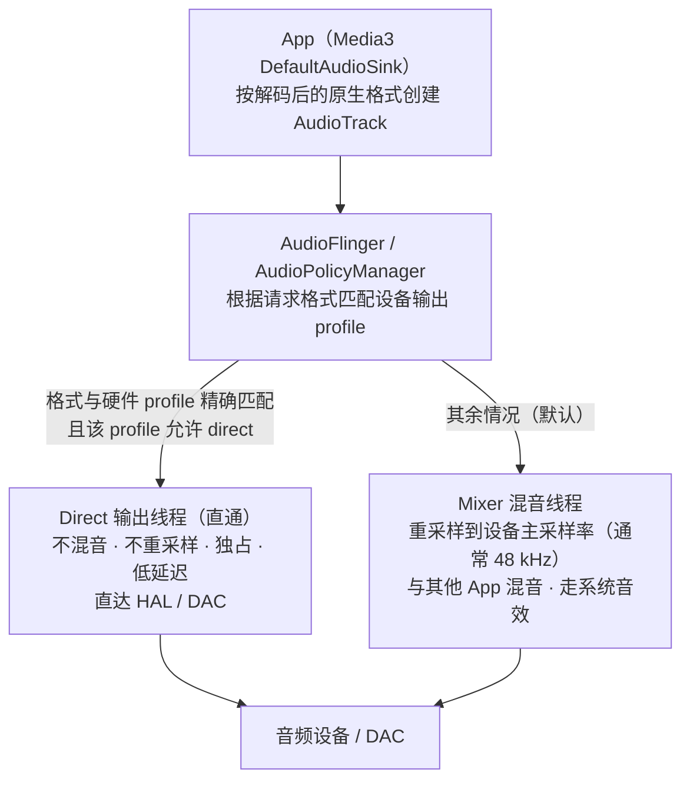

# Direct 直通音频输出原理与实现（PixelPlayerOSS）

> 状态：**已实现**（设置中为实验性开关）
> 更新：2026-09-10
> 分支：`pisces/port`（`pisces312/PixelPlayerOSS`，GPL-3.0-or-later fork）
> 相关提交：`09b5756c`（Add selectable audio output mode）、`80228b68`（Add experimental direct audio output mode）
> 本文结论基于对仓库代码的阅读，以及对 Media3 1.10.1 产物（`media3-exoplayer` AAR 字节码）的反编译核查

---

## 1. 一句话结论

**Direct（直通）音频输出** = 用 **Media3 未经修改的默认 AudioSink** 播放，让解码后的**原生采样率 / 声道数 / 编码**不经任何应用层处理直接交给 `android.media.AudioTrack`；Android 的 AudioPolicyManager 在**设备硬件格式与请求格式精确匹配**时授予 **direct output thread（直通输出线程）**，从而绕过系统混音器的重采样与混音；不匹配时则安全回退到常规混音路径。

本项目中的 `DIRECT` 模式**不承诺**独占输出或 bit-perfect（见 `AudioOutputMode.kt` 注释），它的作用只是"把格式原样交给系统，由系统决定是否直通"。

---

## 2. 原理：Android 音频输出的两条路径

App 播放 PCM 时，最终都会通过 `android.media.AudioTrack`（流式 `MODE_STREAM`）把数据送进系统进程 **AudioFlinger**。AudioFlinger 按音频策略（AudioPolicyManager）决定走哪条输出线程：



### 2.1 Mixer 路径（默认）

- 所有 Track 汇入主混音线程，被**重采样到输出设备的主采样率**（手机上绝大多数是 48 kHz），再与其他应用的声音混合、叠加系统音效后写进 HAL。
- 兼容性最好：任何格式都能播，代价是 44.1 kHz 等非 48 kHz 内容必然被重采样，高解析度 PCM（96/192 kHz）也会被降采样到 48 kHz，丢失原始采样信息。

### 2.2 Direct 路径（直通）

- 当 Track 请求的**采样率 / 声道 / 编码**与设备音频 HAL 声明的某个 **direct 输出 profile** 精确一致时（常见于：Hi-Fi DAC 机型原生支持 44.1/96/192 kHz、USB DAC、HDMI 直通等），AudioPolicyManager 会为该 Track 建立**独立的直通输出线程**：
  - **不做重采样**（格式原样送硬件）；
  - **不参与混音**（同一时间独占该输出）；
  - 系统音效 / 全局均衡器等处理被跳过；
  - 延迟更低。
- **关键点：直通与否的决定权在系统，App 侧无法强占。** App 能做的只有"用精确的原生格式去请求"，系统匹配上了就给直通，匹配不上就静默回退混音。

### 2.3 Media3 侧如何配合（1.10.1 核查结果）

- `DefaultRenderersFactory.buildAudioSink()` 默认返回 `DefaultAudioSink.Builder(context).setEnableFloatOutput(enableFloatOutput).setEnableAudioOutputPlaybackParameters(...).build()`。
- `DefaultAudioSink` 的默认处理器链 = `ChannelMappingAudioProcessor`（声道映射）+ `TrimmingAudioProcessor`（静音修剪）+ PCM 16/float 转换，**没有应用层重采样**；实际 `AudioTrack` 由 `DefaultAudioTrackProvider` 用 `AudioTrack.Builder` 构建：
  - `AudioAttributes` = `USAGE_MEDIA` / `CONTENT_TYPE_MUSIC`；
  - `AudioFormat` = **解码输出原生格式**（采样率、声道、编码原样传入）；
  - `MODE_STREAM` + `setBufferSizeInBytes` + `setSessionId`；
  - 1.10.1 不再显式设置 `PERFORMANCE_MODE_LOW_LATENCY`，也不主动请求 direct flag——完全交给系统策略按格式匹配决定。
- 所以 Media3 的默认 sink 本身就是"**以原生格式请求，由系统决定直通与否**"的路径；本项目的 DIRECT 模式就是**刻意走这条纯默认路径**，去掉应用自加的一切处理。

---

## 3. 项目中的实现

### 3.1 模式定义 `data/model/AudioOutputMode.kt`

```kotlin
enum class AudioOutputMode(val storageKey: String) {
    SYSTEM_DEFAULT("system_default"), // 系统默认
    DIRECT("direct"),                 // Direct 直通输出（实验性）
    PCM_FLOAT("pcm_float");           // 32 位浮点 PCM

    val usesFloatOutput: Boolean get() = this == PCM_FLOAT

    /** Uses Media3's stock AudioSink/AudioTrack path. */
    val usesUnmodifiedMedia3AudioSink: Boolean get() = this == DIRECT
}
```

- `storageKey` 对应 DataStore 持久化值。
- `usesUnmodifiedMedia3AudioSink == true` 只对 `DIRECT` 成立——这是整个实现的分叉开关。
- 旧版 `HI_FI_MODE_ENABLED` 布尔偏好会在 `fromStorageKey` 中迁移为 `PCM_FLOAT`（见测试 `AudioOutputModeTest`）。

### 3.2 核心：`DualPlayerEngine.buildPlayer()` 中重写 `buildAudioSink`

`data/service/player/DualPlayerEngine.kt:1002-1030`：

```kotlin
val renderersFactory = object : DefaultRenderersFactory(context) {
    override fun buildAudioSink(
        context: Context,
        enableFloatOutput: Boolean,
        enableAudioOutputPlaybackParams: Boolean
    ): AudioSink {
        if (audioOutputMode.usesUnmodifiedMedia3AudioSink) {
            // Android's audio policy may grant a DIRECT thread for a compatible
            // device/format, or safely fall back to the mixed path.
            return requireNotNull(
                super.buildAudioSink(context, false, enableAudioOutputPlaybackParams)
            ) { "Media3 did not create its default AudioSink" }
        }
        return DefaultAudioSink.Builder(context)
            .setEnableFloatOutput(audioOutputMode.usesFloatOutput)
            .setEnableAudioOutputPlaybackParameters(enableAudioOutputPlaybackParams)
            .setAudioProcessorChain(
                DefaultAudioSink.DefaultAudioProcessorChain(
                    HiResSampleRateCapAudioProcessor(), // 采样率上限保护（默认 192 kHz）
                    SurroundDownmixProcessor()          // 5.1/7.1 → 立体声 Dolby 降混
                )
            )
            .build()
    }
    // buildVideoRenderers / buildTextRenderers / buildCameraMotionRenderers 均空实现（纯音频）
}
```

要点：

- **DIRECT**：`super.buildAudioSink(context, false, ...)` → Media3 1.10.1 的默认 sink，`enableFloatOutput=false`（整数 PCM），**不带** `HiResSampleRateCapAudioProcessor` 与 `SurroundDownmixProcessor`，原生格式（含 352.8/384 kHz、多声道）原样进入 AudioTrack。
- **SYSTEM_DEFAULT / PCM_FLOAT**：自定义处理器链，分别加**采样率上限保护**（>192 kHz 降采样）与 **Dolby 环绕降混**；`PCM_FLOAT` 额外开启 float 输出。

### 3.3 三模式差异对照

| 维度 | SYSTEM_DEFAULT | DIRECT（实验性） | PCM_FLOAT |
| --- | --- | --- | --- |
| Sink | 自定义链 | **纯 Media3 默认链** | 自定义链 |
| >192 kHz 采样率保护 | 有（封顶 192 kHz） | **无（原样直通）** | 有 |
| 5.1/7.1 降混 | Dolby 矩阵 | 交给 stock 声道映射 | Dolby 矩阵 |
| Float 输出 | 否 | 否 | 是 |
| Audio offload | **允许**（如设备/会话支持） | 强制禁用 | 强制禁用 |
| 共享 audio session id | 使用 | **不使用**（各 player 独立） | 使用 |
| PCM_FLOAT 能力检测 | — | — | 需要，不支持回退默认 |
| 直通收益场景 | 少（有保护处理器） | 最大（格式完全原样） | 少 |

### 3.4 配套机制

1. **Audio offload 仅在 SYSTEM_DEFAULT 启用**（`DualPlayerEngine.kt:158-163`）
   ```kotlin
   fun shouldEnableAudioOffloadForMode(offloadAvailable: Boolean, mode: AudioOutputMode): Boolean =
       offloadAvailable && mode == AudioOutputMode.SYSTEM_DEFAULT
   ```
   offload（HAL 解码直出）与"App 侧精确控制 PCM 格式"互斥，DIRECT/PCM_FLOAT 下强制关闭；`AudioOffloadPreferences.setAudioOffloadMode(ENABLED/DISABLED)` 在建 player 时写入（`DualPlayerEngine.kt:1137-1149`）。
2. **共享 audio session id 只在非 DIRECT 模式使用**（`DualPlayerEngine.kt:1129-1131, 978-990`）：DIRECT 模式每个 player 用自己独立的 session id（直通输出独占，无法跨实例共享）；`activeAudioSessionId` 仍跟随 master player 供外部音效（`externalAudioEffectSession.open`）使用（`MusicService.kt:440-444`）。
3. **PCM_FLOAT 能力检测**（`HiFiCapabilityChecker.kt`）：两段式检测——`AudioTrack.getMinBufferSize` 预检 + 实际实例化 `ENCODING_PCM_FLOAT` 的 AudioTrack 并检查 `STATE_INITIALIZED`；结果缓存。不支持时在 `SettingsViewModel` 与 `DualPlayerEngine.setAudioOutputMode` 两处都回退 `SYSTEM_DEFAULT`。
4. **HiResSampleRateCapAudioProcessor**（`HiResSampleRateCapAudioProcessor.kt`）：对 >192 kHz 的 16-bit/float PCM 按整数因子求平均降采样到 ≤192 kHz，规避部分设备在 352.8/384 kHz 上的 "loading audio" 卡死。**DIRECT 模式刻意移除了这道保护**——这是它能直通原生高解析度采样率的原因，也是它的主要风险来源。
5. **SurroundDownmixProcessor**（`SurroundDownmixProcessor.kt`）：对 5.1/7.1 声道用 Dolby 标准系数（0.707）降混为立体声。DIRECT 模式不启用，多声道内容交给 stock 的 `ChannelMappingAudioProcessor`（设备支持多声道输出则保留，否则自行映射）。

### 3.5 设置链路与持久化

```
SettingsCategoryScreen（ThemeSelectorItem, SettingsCategoryScreen.kt:974-1009）
  → SettingsViewModel.setAudioOutputMode（PCM_FLOAT 不支持时回退, SettingsViewModel.kt:645-656）
  → UserPreferencesRepository.setAudioOutputMode（DataStore 写 AUDIO_OUTPUT_MODE，
      同时删除遗留 HI_FI_MODE_ENABLED, UserPreferencesRepository.kt:282-295）
  → MusicService collect audioOutputModeFlow（MusicService.kt:452-456）
  → DualPlayerEngine.setAudioOutputMode（再做一次 PCM_FLOAT 能力回退, DualPlayerEngine.kt:1204-1217）
  → rebuildPlayersPreservingMasterState（重建 player 保留播放状态, DualPlayerEngine.kt:820-863）
```

- 设置文案明确说明：选择解码后的 PCM 交给 Android 的方式，切换会短暂重启音频输出（`res/values/strings_settings.xml:172-180`）。
- `DIRECT` 文案："Attempts to use the same sample rate as the audio on most devices to avoid unnecessary resampling."（尝试在多数设备上使用与音频相同的采样率，避免不必要的重采样）——与实现一致。
- `PCM_FLOAT` 文案明确标注"not bit-perfect"，与整体设计口径一致（不承诺独占/逐位保真）。

### 3.6 模式切换

`setAudioOutputMode` 变更时调用 `rebuildPlayersPreservingMasterState`：

1. `capturePlayerRebuildState()` 抓取当前队列、索引、播放位置、`playWhenReady`、repeat/shuffle、音量、播放参数等；
2. 取消进行中的过渡（crossfade）与 offload fallback 任务；
3. 释放 playerA / playerB；
4. 用新 `audioOutputMode` 重新 `buildPlayer()`；
5. 恢复媒体队列与状态，`prepare()` 后继续播放。

这是"切换模式会短暂重启音频输出"的实现来源。

### 3.7 测试

- `AudioOutputModeTest.kt`：`fromStorageKey` 恢复 DIRECT、遗留 HiFi 开关迁移到 PCM_FLOAT、显式模式优先、未知值回退默认。
- `AudioOffloadPolicyTest.kt`：`shouldEnableAudioOffloadForMode` 断言 offload 只在 SYSTEM_DEFAULT 生效。

---

## 4. 为什么标为"实验性"：收益与风险

**收益**

- 在硬件原生支持所播采样率的设备上（Hi-Fi DAC 机型、USB DAC、部分 HDMI 场景），获得 **direct 输出线程**：无重采样、无混音、低延迟，高解析度 PCM 得以保持原始采样率直达 DAC，是这类设备上音质收益最大的输出方式。
- 移除采样率上限后，352.8/384 kHz 内容也能以原始速率尝试直通（代价见风险）。

**风险 / 局限**

1. **设备相关、不可保证**：多数手机内置输出主采样率是 48 kHz，44.1 kHz 内容即便在 DIRECT 下也大概率仍走混音重采样；能否直通完全取决于设备 HAL 的 output profile。代码注释明确声明"deliberately does not promise exclusive output / bit-perfect"。
2. **移除 192 kHz 采样率保护**：352.8/384 kHz 在部分设备上会触发 "loading audio" 卡死——这正是 `HiResSampleRateCapAudioProcessor` 存在的原因；DIRECT 模式选择信任设备、放弃保护。
3. **无 Dolby 环绕降混**：多声道内容改由 stock 声道映射处理，输出质量依设备而定。
4. **强制关闭 audio offload**：失去 offload 带来的低功耗（省电）与 HAL 直出优势。
5. **切换会重建 player**：产生短暂音频中断；跨模式切换时共享 session id 策略变化，外部音效会话跟随 master 重新绑定。

---

## 5. 代码位置索引

| 内容 | 位置 |
| --- | --- |
| 模式枚举与语义 | `app/src/main/java/com/lostf1sh/pixelplayeross/data/model/AudioOutputMode.kt` |
| AudioSink 构建（三模式分叉） | `data/service/player/DualPlayerEngine.kt:1002-1030` |
| 模式切换入口与 PCM_FLOAT 回退 | `data/service/player/DualPlayerEngine.kt:1204-1217` |
| 重建 player 保留状态 | `data/service/player/DualPlayerEngine.kt:820-863` |
| offload 模式判定 | `data/service/player/DualPlayerEngine.kt:158-163, 1137-1149` |
| 共享 audio session id | `data/service/player/DualPlayerEngine.kt:978-990, 1129-1131` |
| PCM_FLOAT 能力检测 | `data/service/player/HiFiCapabilityChecker.kt` |
| 采样率上限保护（DIRECT 下不启用） | `data/service/player/HiResSampleRateCapAudioProcessor.kt` |
| Dolby 环绕降混（DIRECT 下不启用） | `data/service/player/SurroundDownmixProcessor.kt` |
| 偏好持久化 / 迁移 | `data/preferences/UserPreferencesRepository.kt:282-295` |
| 设置 UI | `presentation/screens/SettingsCategoryScreen.kt:974-1009` |
| ViewModel 接线与回退 | `presentation/viewmodel/SettingsViewModel.kt:645-656` |
| 服务侧订阅 | `data/service/MusicService.kt:452-456` |
| 单元测试 | `app/src/test/java/com/lostf1sh/pixelplayeross/data/model/AudioOutputModeTest.kt`、`data/service/player/AudioOffloadPolicyTest.kt` |
| 文案（英文基准） | `app/src/main/res/values/strings_settings.xml:172-180` |

---

## 6. 如何确认实际是否直通（而非 fallback）

**前提：设置里的 DIRECT 只是"请求模式"，系统是否授予 direct 输出线程 App 侧完全静默，项目当前没有任何运行时指示器。** App 侧也没有可靠的公开 API 能直接读出"是否直通"（Media3 不暴露；`AudioTrack.getPerformanceMode()` 只反映 fast track 且 Media3 1.10.1 根本不设置；`AudioTrack` 也没有公开的 `getSampleRate()` 用于核对是否被重采样）。要确认只能走系统级观测：

### 6.1 最权威：`adb shell dumpsys audio`

播放过程中执行（PowerShell/终端）：

```powershell
adb shell "dumpsys audio | grep -iE 'direct|flags|session|samplerate|sample rate'"
```

- 在 `Output threads` 段落里找 flags 带 **`AUDIO_OUTPUT_FLAG_DIRECT = 0x4`** 的 direct 输出线程（通常显示为 `flags: 0x...`，低 4 位含 `0x4`；FAST=0x8、OFFLOAD=0x200 不是 DIRECT）。
- 再确认你的包（`com.lostf1sh.pixelplayeross` 或 `.debug`）的 track 及其 session id / 采样率**挂在那个 direct 线程下**。若 track 挂在 48 kHz 的 mixer 线程下（flags 无 0x4），说明被 fallback 了。

### 6.2 交叉验证：用采样率"测谎"

播放一个原生采样率 ≠ 48 kHz 的文件（44.1 kHz，或 96/192 kHz FLAC），配合同上 dumpsys：

- track 实际采样率 = 文件原生采样率且线程为 direct → 直通成功；
- track 实际采样率显示 48000 → 被 mixer 重采样，走了 fallback。

### 6.3 logcat（设备相关，仅供参考）

```powershell
adb logcat -s AudioTrack AudioFlinger AudioPolicyManager
```

部分设备/驱动创建 direct track 时会打印相关日志，可靠性依 ROM 而定，不能作为唯一依据。

### 6.4 行为特征（间接）

- direct 输出绕过混音，**系统级音效（均衡器 / 杜比音效）对该应用不生效**；
- direct 输出同一时刻同一设备**独占**——若同时有其他应用在出声，基本不可能拿到 direct。

---

## 7. 与 china-only 分支 "32 位精度输出" 的关系

`D:\3rd-party-projects\PixelPlayer`（china-only）的 **Hi-Fi Mode**（文案 "Float 32-bit audio output"，布尔开关 `hiFiModeEnabled`）就是 **32 位浮点输出**，其实现与 OSS 的 **`PCM_FLOAT`** 逐项等价，**与 `DIRECT` 不是一回事**：

| 对比项 | china-only Hi-Fi Mode | OSS PCM_FLOAT | OSS DIRECT |
| --- | --- | --- | --- |
| 本质 | 32-bit float 输出（处理余量） | 32-bit float 输出（处理余量） | 整数 PCM 原样直通（保采样率） |
| `setEnableFloatOutput` | `hiFiModeEnabled` | `usesFloatOutput`（=true） | false |
| 自定义处理器链（192 kHz 上限 + Dolby 降混） | 有 | 有 | 无（纯 Media3 默认链） |
| `setEnableAudioFloatOutput` | 是 | 是 | 否 |
| PCM_FLOAT 能力检测 | 有（不支持禁用） | 有（不支持回退默认） | — |
| 采样率是否原样 | 否（>192 kHz 被封顶） | 否（>192 kHz 被封顶） | 是（含 352.8/384 kHz） |

- china-only 的 Hi-Fi 关闭态 = OSS 的 `SYSTEM_DEFAULT`（float 关 + 同样自定义链）；
- `HiFiCapabilityChecker` 两份文件仅包名/注释不同，两段式检测逻辑完全一致；
- 两个维度要分清：**DIRECT 优化"采样率不被重采样"，PCM_FLOAT/32 位浮点优化"中间处理精度"**，二者并不互斥，但 OSS 目前是单选模式。

---

## 8. 核查方法

- 仓库代码：以上所有引用均来自 `main` 分支实际源码，行号以 2026-09-10 版本为准。
- Media3 1.10.1：从本地 Gradle 缓存 `media3-exoplayer-1.10.1.aar` 解出 `classes.jar`，用 `javap` 反编译确认：
  - `DefaultRenderersFactory.buildAudioSink()` 仅构建 `DefaultAudioSink.Builder`（无自定义处理器链）；
  - `DefaultAudioSink.DefaultAudioProcessorChain` 字段含 `ChannelMappingAudioProcessor`、`TrimmingAudioProcessor`、PCM 16/float 转换器（**无重采样器**）；
  - `DefaultAudioTrackProvider` 用 `AudioTrack.Builder` + `MODE_STREAM` 构建，未显式设置 direct flag 或 performance mode，直通与否完全由系统策略按格式匹配决定。
- china-only 对比：`PixelPlayer`（分支 `china-only`）`DualPlayerEngine.kt:1048-1063` 的 `buildAudioSink` 与 `HiFiCapabilityChecker.kt`，与 OSS 逐项比对。
