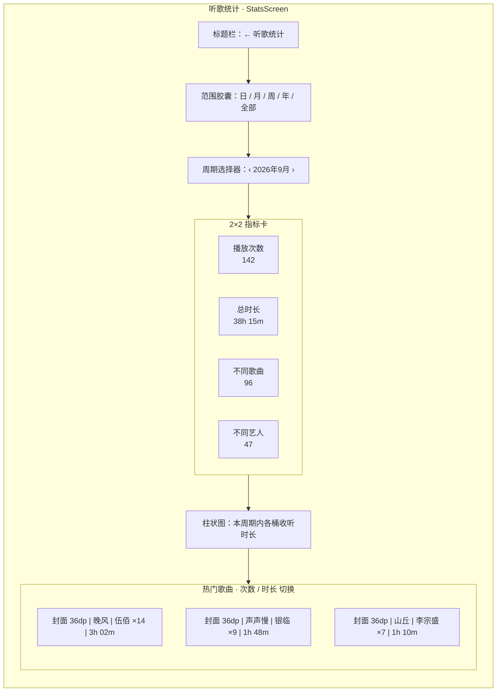
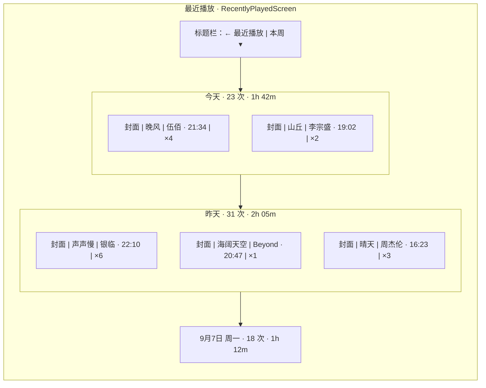
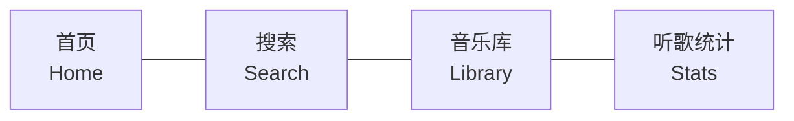
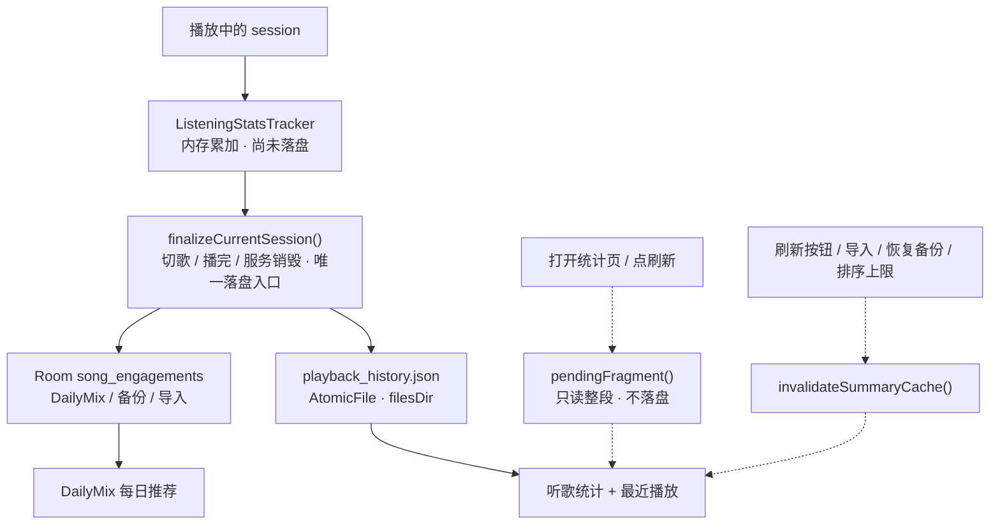

# 听歌统计与最近播放设计（PixelPlayerOSS）

> 状态：**已实现**
> 更新：2026-09-10
> 分支：`pisces/port`（`pisces312/PixelPlayerOSS`，GPL-3.0-or-later fork）
> 原始线框：`E:\downloads\听歌统计与最近播放重设计线框.html`
> 实施计划：`docs/stats-redesign-plan.md`

---

## 1. 设计目标

1. **统计是一级入口**：听歌统计提升为底部第 4 个 Tab，放在音乐库右侧，不再需要首页下滑很久才能点到。
2. **所有歌曲行可直接播放**：统计页与最近播放里出现的每一首歌，点一下就播。
3. **一屏看完核心数据**：中文周期切换 + 2×2 指标卡 + 柱状图 + 热门歌曲，去掉过度设计的卡片堆砌。
4. **最近播放按天分组**：同一天同歌曲合并，右侧带 `×N` 徽章，天级 sticky header 给出「次数 · 时长」。

---

## 2. 界面结构

### 2.1 听歌统计（StatsScreen）



区域说明：

| 区域 | 线框要求 | 实现要点 |
|---|---|---|
| 标题栏 | `← 听歌统计` | 一级 Tab 用普通 `TopAppBar`（无返回键），右侧刷新按钮 |
| 范围胶囊 | 日 / 月 / 周 / 年 / 全部 | 中文短标签 `shortNameRes()`，选中态紫底胶囊 |
| 周期选择器 | `‹ 2026年9月 ›` 灰底圆角 | 绝对周期 `StatsPeriod(unit, anchor)`，中文格式按粒度切换 |
| 指标卡 | 2×2 四格 | 播放次数 / 总时长 / 不同歌曲 / 不同艺人 |
| 柱状图 | 7 根柱子 | 桶由 `StatsPeriod` 锚点决定，无指标切换 |
| 热门歌曲 | 标题 + 次数/时长切换 | 排序键切换决定列表顺序与右侧数值 |
| 歌曲行 | 封面 36dp + 歌名 + 艺人 · ×N + 时长 | 整行点击直接播放 |

### 2.2 最近播放（RecentlyPlayedScreen）



区域说明：

| 区域 | 线框要求 | 实现要点 |
|---|---|---|
| 范围下拉 | `本周 ▾` | 中文标签，复用 `StatsTimeRange.displayNameRes()` |
| 天 header | 今天 / 昨天 / 9月7日 周一 | sticky；右侧显示「N 次 · 时长」 |
| 歌曲行 | 艺人 · 最后播放时刻 + `×N` 徽章 | 同日同歌合并，整行点击播放 |

---

## 3. 导航结构

底部导航从 3 项扩到 4 项，Stats 位于 Library 右侧：



- 图标复用 `res/drawable/rounded_monitoring_24.xml`（柱状图 + 折线）。
- `MainRootRoutes.isMainRootRoute` / `mainRootRouteIndex` 同步加入 Stats（index 3），否则转场方向错且会被 ScreenWrapper 加 dim/圆角。
- `LaunchTab` 增加 `STATS`，设置页「默认启动页面」可选听歌统计（默认仍是 Home）。
- 首页 `StatsOverviewCard` 已移除（与一级 Tab 冗余）。

---

## 4. 数据流



关键点：

1. **统计页只读 JSON 文件，不读 Room。** `song_engagements` 表只服务 DailyMix 推荐、Poweramp 导入与备份；播放时是双写（Room + JSON），但聚合查询全走 JSON。
2. **落盘时机只有一处**：`finalizeCurrentSession()`（切歌 / 播完 / 服务销毁）。**打开统计页与点刷新都不落盘，也没有定时落盘。** 2026-09-15 之前的 `flushCurrentSession()`（开页 / 刷新时落盘）已整体删除 —— 它把「一次连续播放」切成多段，而聚合是「区间取并集 + 次数求和」，于是时长正确、播放次数每刷一次 +1（JSON 与 Room 双端虚高）。根因与修法见 `listening-stats-load-plan.md` §10。
3. **首屏不为空**：播放中打开统计页时，未落盘的当前片段由 `ListeningStatsTracker.pendingFragment()`（只读、幂等，不改 session 状态）作为内存事件叠加进本次聚合 —— 返回的总是「本 session 从开始至今的整段」，与最终落盘的那条事件区间严格相等。旧实现走的是 `StatsViewModel.init` 里的 `flushCurrentSession()`，代价是整文件读 ×2 + 全量解析 + 全量序列化 + `fsync`，这也是「播放中切到统计页出现爆音」最可疑的来源。
4. **聚合结果按周期缓存**：键为「日历周期身份」（`StatsPeriod.range` + 起止日期，见 `PlaybackStatsRepository.summaryCache`）。打开页面与来回切换周期都只算一次；播放产生的新事件不会主动清缓存，只有刷新按钮 / 导入 / 恢复备份 / 排序上限变更（`invalidateSummaryCache()`）才丢弃结果。刷新按钮因此只做「丢缓存 + 重查歌曲表 + 重算当前周期」。
5. china-only 分支是同一套实现（无 `pendingFragment` / 无结果缓存），因此以上都是 OSS 侧改进，不是移植。

---

## 5. 交互规则

| 交互 | 行为 |
|---|---|
| 点击歌曲行 | `PlayerViewModel.playSongById(songId)` 直接播放（统计页 + 最近播放均支持） |
| 点击艺人 / 专辑行 | 跳转到 `ArtistDetail` / `AlbumDetail` |
| 周期 `‹` | 上一周期（`StatsPeriod.shift(-1)`） |
| 周期 `›` | 下一周期（`StatsPeriod.shift(+1)`，钳到当前周期） |
| 热门歌曲排序切换 | 按次数或时长重排，右侧数值同步变化 |
| 范围胶囊 | 日 / 周 / 月 / 年 / 全部，切换后周期锚点重置为当前 |

---

## 6. 主要文件

```
presentation/screens/StatsScreen.kt                        # 统计页（重写，3043 → ~846 行）
presentation/screens/RecentlyPlayedScreen.kt               # 最近播放（中文 + 天分组）
presentation/viewmodel/StatsViewModel.kt                   # 周期状态 + 按需计算 + 刷新
presentation/viewmodel/ListeningStatsTracker.kt            # pendingFragment() / flushCurrentSession() / 定时落盘
presentation/components/RecentlyPlayedRangeSelector.kt     # 中文范围选择
presentation/components/MergedRecentlyPlayedSongItem.kt    # 合并行 + ×N 徽章
presentation/navigation/MainRootRoutes.kt                  # 一级路由注册
data/stats/StatsPeriod.kt                                  # 绝对周期（unit + anchor）
data/stats/PlaybackStatsRepository.kt                      # 聚合查询（读 JSON）
MainActivity.kt / data/preferences/LaunchTab.kt            # 底部 Tab + 启动页
res/values*/strings_presentation_batch_g.xml               # 中文字符串
```

---

## 7. 版权说明

- 界面布局参考用户提供的线框稿，Compose 实现在 OSS 侧重写。
- china-only（`com.theveloper.pixelplay`）为专有仓库，其 glue 层（ViewModel / DI / UI 接线 / strings）不做复制；本设计中的实现均为 OSS 侧独立编写，许可证 GPL-3.0-or-later。
- 数据层与 china-only 同源于上游 OSS 实现（`AtomicFile` + `playback_history.json`），非专有代码。
